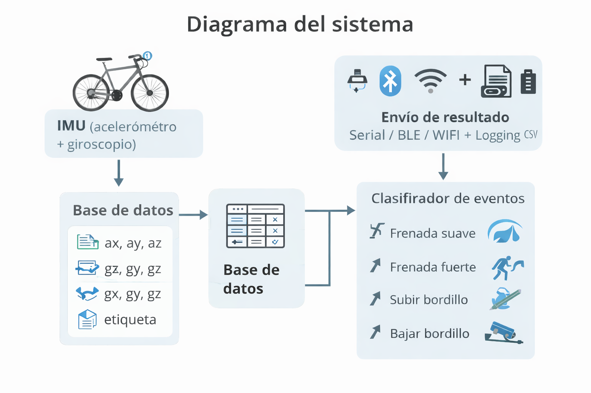
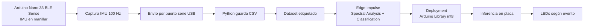

# BrakeBike

Proyecto TinyML/IoT para detección de eventos de conducción en bicicleta mediante una IMU montada en el manillar y un modelo entrenado en Edge Impulse.



> Figura generada con IA como diagrama general del flujo del sistema.

## Objetivo

El objetivo del proyecto es implementar un prototipo capaz de detectar eventos de conducción en bicicleta a partir de señales inerciales medidas con la **Arduino Nano 33 BLE Sense**.

La versión final implementada clasifica tres estados:

1. **normal**: circulación sin evento relevante.
2. **frenada_fuerte**: evento de deceleración brusca.
3. **subir_bordillo**: simulación de subida de bordillo mediante levantamiento de la rueda delantera.

Durante el desarrollo se probó también la clase **frenada_suave**, pero se descartó porque su señal IMU era muy parecida a la clase `normal`, generando confusión en la matriz de clasificación. La decisión se justifica en el apartado de análisis.

## Hardware utilizado

- Arduino Nano 33 BLE Sense.
- IMU integrada LSM9DS1:
  - acelerómetro de 3 ejes,
  - giróscopo de 3 ejes.
- Protoboard fijada al manillar.
- LED rojo externo para alarma de `frenada_fuerte`.
- LED verde externo para indicar captura de ventana.
- Ordenador portátil para la captura inicial del dataset mediante USB/Serial.
- Powerbank o USB para alimentación durante pruebas.

## Ubicación del sensor

La placa se colocó en la zona del **manillar/potencia**, fijada de forma rígida para que las señales medidas correspondieran al movimiento de la bicicleta y no a vibraciones sueltas del montaje.

Esta ubicación se eligió porque permite captar bien:

- cambios de aceleración durante frenadas,
- cambios de orientación y aceleración vertical al levantar la rueda delantera,
- vibraciones generales del conjunto manillar-bicicleta.

## Flujo de trabajo



## Estructura del repositorio

```text
BrakeBike/
├── README.md
├── docs/
│   └── fig_diagrama_sistema.png
├── introduccion/
│   └── README.md
├── extraccion/
│   ├── README.md
│   ├── arduino_dataset_logger/
│   ├── python_logger/
│   └── docs/
├── analisis/
│   ├── README.md
│   ├── datos_crudos/
│   ├── datos_procesados/
│   ├── graficas/
│   ├── edge_impulse/
│   └── scripts/
├── implementacion_final/
│   ├── README.md
│   ├── bike_event_detector_final/
│   └── docs/
└── presentacion/
```

## Resumen de resultados

Se compararon dos configuraciones principales:

- Modelo inicial con `frenada_suave`, `frenada_fuerte`, `normal` y `subir_bordillo`.
- Modelo final eliminando `frenada_suave`.

La clase `frenada_suave` se descartó porque se confundía con `normal`. Tras eliminarla, las clases restantes quedaron mejor separadas y el modelo final alcanzó un comportamiento más robusto para la demo.

## Implementación final

El código final ejecutado en la placa realiza:

1. Captura de una ventana IMU.
2. Clasificación mediante el modelo exportado desde Edge Impulse.
3. Aplicación de umbrales por clase.
4. Activación de salidas:
   - RGB interno blanco: `normal` o desconocido.
   - RGB interno rojo + LED rojo externo: `frenada_fuerte`.
   - RGB interno verde: `subir_bordillo`.
   - LED verde externo: ventana de captura activa.

## Estado del proyecto

- [x] Revisión/estado de la cuestión.
- [x] Montaje de la placa en bicicleta.
- [x] Código de extracción de datos.
- [x] Captura de datos IMU en CSV.
- [x] Entrenamiento en Edge Impulse.
- [x] Análisis comparativo de clases.
- [x] Eliminación justificada de `frenada_suave`.
- [x] Deployment como librería Arduino.
- [x] Código final de inferencia en placa.
- [x] Demo con LEDs.

## Presentación

La presentación del proyecto se encuentra en la carpeta `presentacion/`.

## Nota sobre archivos grandes

Si se incluyen vídeos de demostración, conviene revisar su tamaño antes de subirlos a GitHub. Para archivos grandes puede ser necesario usar **Git LFS**.
