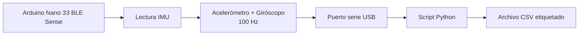

# Extracción de datos

## Objetivo

Este apartado contiene el código utilizado para capturar el dataset real de eventos ciclistas.

Como no se utilizó módulo microSD, la adquisición se realizó conectando la Arduino Nano 33 BLE Sense al ordenador mediante USB. La placa lee la IMU y envía los datos por puerto serie. Un script de Python en el ordenador recibe esos datos y los guarda en archivos CSV.

## Flujo de extracción



## Funcionamiento

El firmware de extracción realiza:

1. Inicialización de la IMU LSM9DS1.
2. Selección de clase mediante botón.
3. Inicio de grabación mediante botón.
4. Muestreo de acelerómetro y giróscopo a 100 Hz.
5. Envío de cada muestra por puerto serie.

El script Python realiza:

1. Apertura del puerto COM.
2. Detección de mensajes `#START` y `#END`.
3. Creación automática de un archivo CSV por grabación.
4. Almacenamiento de las columnas IMU.

## Formato del CSV

Los archivos generados siguen este formato:

```csv
timestamp,accX,accY,accZ,gyrX,gyrY,gyrZ
0,0.012,-0.034,1.002,0.41,-0.12,0.08
10,0.014,-0.030,0.998,0.37,-0.09,0.11
20,0.018,-0.026,0.991,0.52,-0.08,0.15
```

La columna `timestamp` está en milisegundos. El intervalo aproximado entre muestras es de 10 ms, equivalente a 100 Hz.

## Clases grabadas

Se capturaron grabaciones de:

- `normal`
- `frenada_suave`
- `frenada_fuerte`
- `subir_bordillo`

Posteriormente, en la fase de análisis se descartó `frenada_suave`.


## Diagrama


## Procedimiento de uso

1. Cargar el firmware de extracción en la Arduino.
2. Conectar la placa al portátil por USB.
3. Ejecutar el script Python.
4. Seleccionar la clase con el botón correspondiente.
5. Iniciar la grabación.
6. Realizar el evento varias veces durante la ventana de grabación.
7. Guardar automáticamente el CSV.
8. Repetir el proceso para cada clase.

## Notas

Para evitar errores de etiquetado, cada grabación se hizo con una sola clase. Después se usó Edge Impulse para dividir las grabaciones largas en muestras individuales mediante ventanas.
