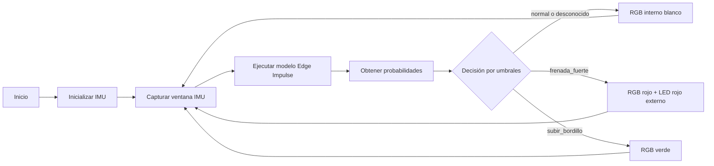
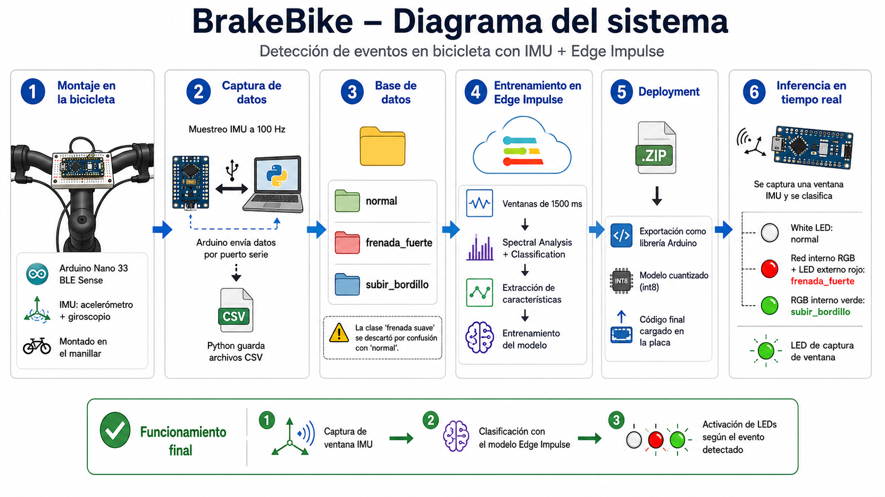

# Implementación final

## Objetivo

Esta carpeta contiene el código final cargado en la Arduino Nano 33 BLE Sense. El firmware integra:

1. Muestreo de la IMU.
2. Clasificación mediante el modelo exportado desde Edge Impulse.
3. Decisión mediante umbrales por clase.
4. Activación de salidas visuales.

## Flujo de funcionamiento



## Entradas

La entrada del modelo son seis señales IMU:

```text
accX, accY, accZ, gyrX, gyrY, gyrZ
```

El orden de las señales en el código final debe coincidir con el orden usado durante la captura y entrenamiento:

```text
timestamp,accX,accY,accZ,gyrX,gyrY,gyrZ
```

## Ventana de clasificación

El modelo fue entrenado con ventanas de:

```text
1500 ms
```

Durante la ejecución, la placa captura una ventana completa de datos y después ejecuta la inferencia.

## Salidas

| Resultado | RGB interno | LED rojo externo | LED verde externo |
|---|---|---|---|
| `normal` | Blanco | Apagado | Solo durante captura |
| `frenada_fuerte` | Rojo | Encendido | Solo durante captura |
| `subir_bordillo` | Verde | Apagado | Solo durante captura |
| Desconocido | Blanco | Apagado | Solo durante captura |

El LED verde externo indica que la placa está capturando la ventana de datos. El movimiento debe realizarse durante ese intervalo.

## Umbrales

El código final utiliza umbrales separados por clase:

```cpp
#define TH_FRENADA_FUERTE  0.90f
#define TH_SUBIR_BORDILLO  0.65f
#define TH_NORMAL          0.50f
#define TH_MARGIN_FUERTE   0.10f
```

Interpretación:

- `TH_FRENADA_FUERTE`: umbral alto para evitar falsas alarmas.
- `TH_SUBIR_BORDILLO`: umbral para detectar el levantamiento de la rueda.
- `TH_NORMAL`: umbral para considerar el estado normal.
- `TH_MARGIN_FUERTE`: margen adicional para que `frenada_fuerte` solo se active si gana claramente frente al resto.

Si la placa detecta demasiadas frenadas fuertes falsas, se puede subir:

```cpp
#define TH_FRENADA_FUERTE  0.95f
#define TH_MARGIN_FUERTE   0.20f
```

Si no detecta eventos reales, se pueden bajar los umbrales correspondientes.

## Conexiones

### LED rojo externo

```text
D4 → resistencia 220/330 Ω → pata larga LED rojo
pata corta LED rojo → GND
```

### LED verde externo de captura

```text
D6 → resistencia 220/330 Ω → pata larga LED verde
pata corta LED verde → GND
```

## Archivos esperados

```text
implementacion_final/
├── README.md
├── bike_event_detector_final/
│   └── bike_event_detector_final.ino
└── docs/
    └── diagrama_funcionamiento.png
```

## Diagrama



## Prueba de funcionamiento

1. Cargar el código final en la Arduino.
2. Alimentar la placa por USB o powerbank.
3. Esperar al estado normal: RGB blanco.
4. Realizar una frenada fuerte durante el encendido del LED verde de captura.
5. Comprobar RGB rojo y LED rojo externo.
6. Simular subida de bordillo levantando la rueda delantera.
7. Comprobar RGB verde.

## Limitaciones

- La inferencia se realiza por ventanas completas, no mediante buffer circular deslizante.
- El sistema depende de que el montaje esté fijo y siempre en la misma orientación.
- La clase `frenada_suave` no se incluye en la versión final por su baja separabilidad frente a `normal`.
